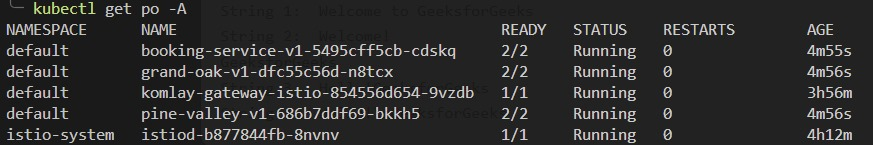
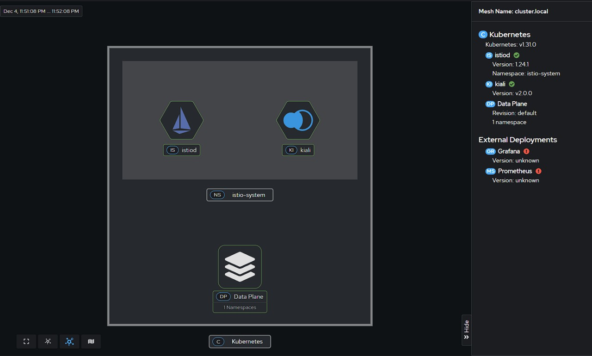
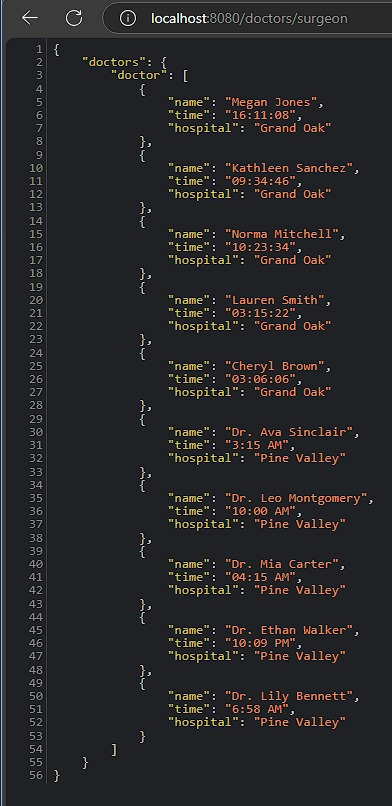
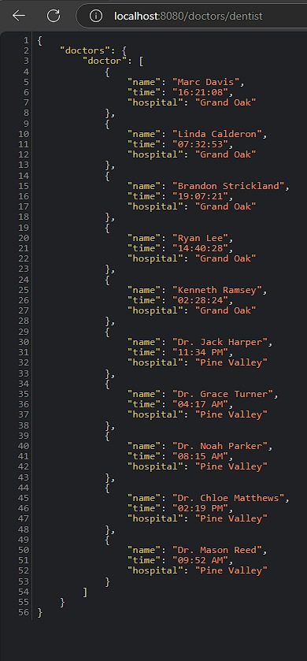
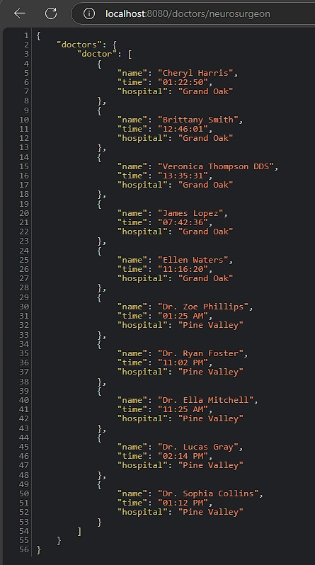

# KomlayServiceMesh
Service mesh orchestration for adapting service endpoints of Grand Oak Hospital and Pine Valley Hospital into a single endpoint using [istio](https://istio.io)🚢 on [minikube](https://minikube.sigs.k8s.io/)⚓


## Service Mesh Orchestration - Tutorial 🚀
adapted from
> https://kubernetes.io/docs/tutorials/hello-minikube/

> https://istio.io/latest/docs/setup/getting-started/

### 1. Preparation
on this tutorial, we are going to use a local image we manually build using local docker daemon (to simplify container registry and build simplicity)

#### Build the corresponding image for each service
1. Booking Service
```sh
cd booking-service/
docker build -t booking-service .
```
2. Grand Oak Hospital Service
```sh
cd grandoak-service/
docker build -t grand-oak .
```
3. Pine Valley Hospital Service
```sh
cd pinevalley-service/
docker build -t pine-valley .
```


#### Load the image into minikube registry
this step is required since `services.yaml` crd refer to this image to be able to create Deployment(s)

> you can only do this after a minikube cluster is started

```sh
minikube image load booking-service
minikube image load grand-oak
minikube image load pine-valley
```

for other ways to do this, check here https://minikube.sigs.k8s.io/docs/handbook/pushing/

>tips: when you are trying to overwrite an already-loaded image, you can check if `minikube image load` succeed by comparing the `IMAGE ID` from `docker image ls` and `minikube image ls --format='table'`

> tips: if you are unable to do overwriting load for the correct IMAGE, you can check for running k8s deployments which may currently use the image. 

### 2. Minikube
refer to https://minikube.sigs.k8s.io/docs/start/?arch=%2Fwindows%2Fx86-64%2Fstable%2F.exe+download
1. Install Minikube on your platform
2. Start a new cluster
3. (optional) create an alias for kubectl (if you will be using minikube-builtin kubectl)

### 3. Download Istio
download istio and export istioctl to path
refer to https://istio.io/latest/docs/setup/getting-started/#download

### 4. Install Istio
refer to https://istio.io/latest/docs/setup/getting-started/#install
1. install istio using the 'demo' profile

```sh
    istioctl install --set profile=demo
```

> alternatively, you can use the crd we have in this path "kube/profile/demo.yaml"
```sh   
    istioctl install -f kube/profiles/demo.yaml
```

2. add namespace label to enable automatic envoy sidecar injection
```sh
kubectl label namespace default istio-injection=enabled
```

### 5. Install the Kubernetes Gateway API CRDs
refer to https://istio.io/latest/docs/setup/getting-started/#gateway-api

```sh
kubectl get crd gateways.gateway.networking.k8s.io &> /dev/null || \
{ kubectl kustomize "github.com/kubernetes-sigs/gateway-api/config/crd?ref=v1.2.0" | kubectl apply -f -; }
```

### 6. Create config map
```sh
kubectl create configmap json-lua --from-file=json.lua
```

> alternative `kubectl create configmap json-lua --from-file json.lua`

### 7. Deploy the app
```sh
kubectl apply -f kube/services.yaml    
```



### 8. Open the app to outside traffic
1. Create Kubernetes Gateway
```sh
kubectl apply -f kube/gateways.yaml    
```

### 9. Forward the Port
```sh
kubectl port-forward svc/istio-ingressgateway 8080:80 -n istio-system
```
now, you can access the exposed API from `localhost:8080`

## Visualization of the Service Mesh 
using istio kiali dashboard we can make a correct mesh representation for our service mesh




## Endpoints
### Doctors List
Endpoints for Doctors List for both hospital booking service
Available doctor types being `surgeon`, `dentist`, and `neurosurgeon`
```url
http://localhost:8080/doctors/<doctorType>
```

1. `Surgeon`



2. `Dentist`



3. `Neurosurgeon`



### Ping
check this service health by doing a simple ping
```url
http://localhost:8080/ping
```

### Health Check
check each hospital API health by doing a simple doctor list call

Grand Oak Service
```url
http://localhost:8080/g
```

Pine Valley Service
```url
http://localhost:8080/p
```
